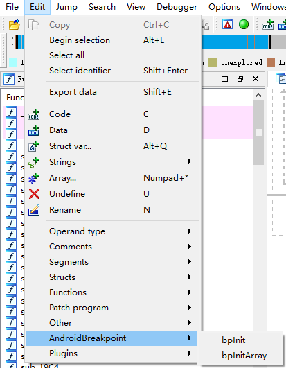

# IDAAndroidBreakpoint
IDA plugin aid to set android so breakpoint
# Install
1. Be sure your IDA Pro has installed the IDAPython plugin
2. Put AndroidBreakpoint.py into plugins folder under your IDA Pro installation path.
# Usage
Click the Edit->AndroidBreakpoint->bpInit to set breakpoint on init function

Click the Edit->AndroidBreakpoint->bpInitArray to set breakpoint on InitArray function

# Tips
- The plugin will find the init or initArray by the input file ELF program header while your debugger is not on.
- If your debugger is on,the plugin will set the breakpoint on the linker module where the init or initarray function is called.
- The linker's bytecode may be different due to the Android version,so if you can't find the bytecode in debug mode,please get the bytecode from your device,then replace the bytecode in AndroidBreakpoint.py .
